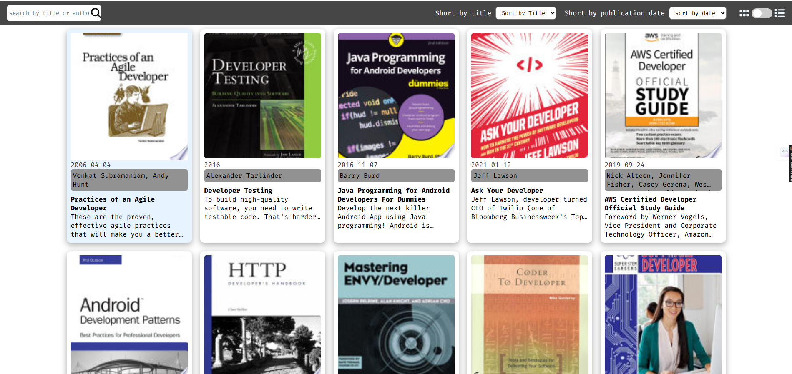
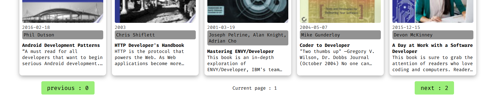
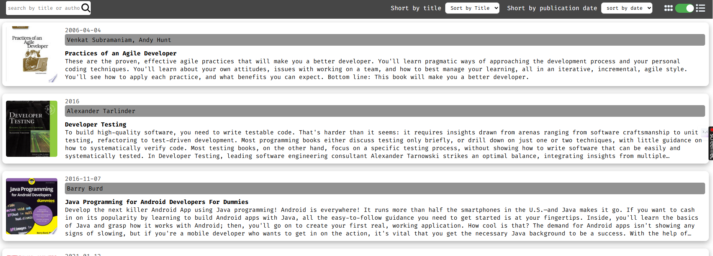
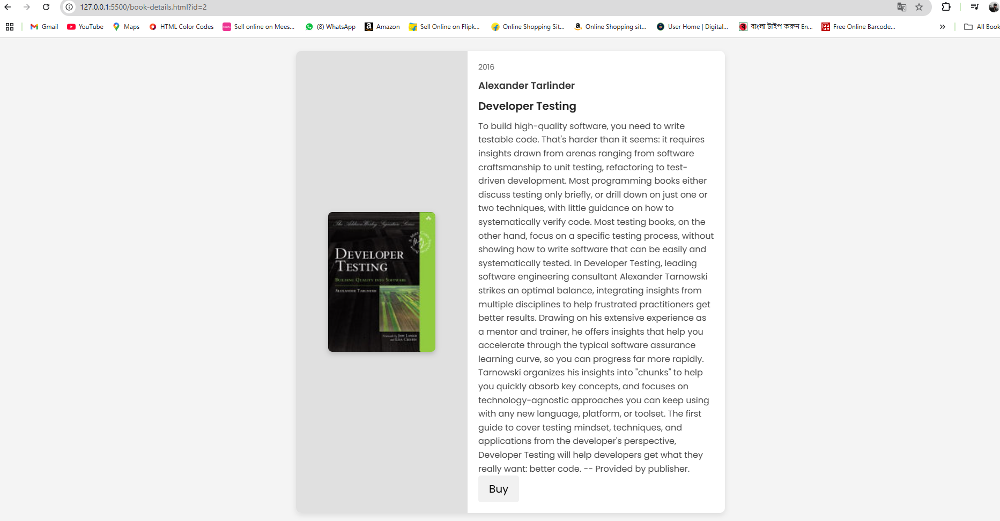

# Books Library

A dynamic and user-friendly Book Library website that fetches and displays book data using the FreeAPI.app. This project demonstrates working with API requests, handling JSON data, and rendering content dynamically with JavaScript.

## 🔗 Live Demo
```
https://api.dipkumarpal.me/small-project/book-library/
```

## 📂 Features
- Fetch and display books from FreeAPI.app
- Toggle between **list view** and **grid view**
- Search books by **title** or **author**
- Sort books alphabetically by **title** or by **published date**
- Pagination to load more books dynamically
- Click on a book to view more details in a **new tab**
## 📂 Features extra feature
- store user previous state on local store (view mode) 


## 📸 Screenshots
<!-- Add relevant screenshots here -->









## use
- Open `index.html` in your browser or use Live Server (VS Code extension).

